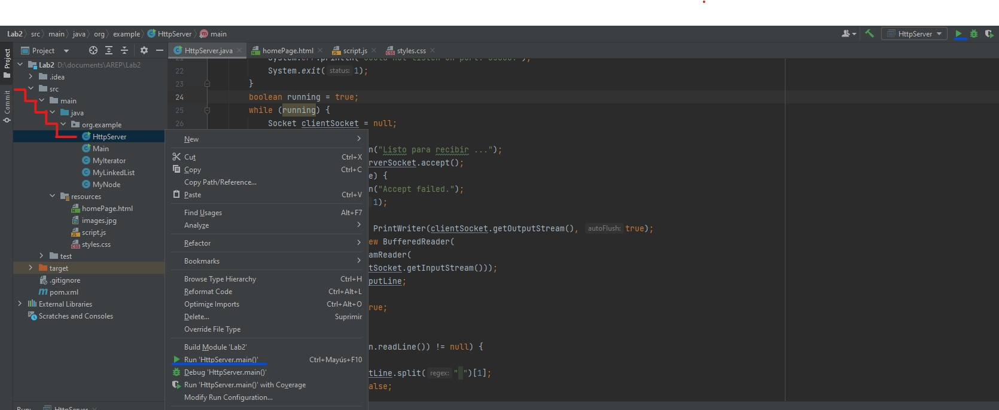

# Lab2 -  DISEÑO Y ESTRUCTURACIÓN DE APLICACIONES DISTRIBUIDAS EN INTERNET
Este proyecto tiene como objetivo la implementación de un servidor web básico en Java, capaz de manejar múltiples solicitudes de manera secuencial (no concurrente). El servidor estará diseñado para leer archivos del disco local y responder a las solicitudes, admitiendo archivos HTML, JavaScript, CSS e imágenes.

## Requisitos previos
Asegúrate de tener las siguientes herramientas y dependencias instaladas antes de configurar el proyecto
#### Maven
Instala Maven, una herramienta de gestión de proyectos para Java. Puedes descargarlo desde el sitio web oficial https://maven.apache.org/install.html
#### Java Development Kit (JDK) 17
Asegúrate de tener instalado JDK 17 en tu máquina. Puedes descargarlo desde la página oficial de OpenJDK.

nota: si por algun motivo el projecto no lo puede ejecutar, prube agregando la siguiente propiedad (antes de las dependencias) en el pom:
~~~
<properties>
<maven.compiler.source>1.8</maven.compiler.source>
<maven.compiler.target>1.8</maven.compiler.target>
</properties>
~~~

## Empezar
Sigue estos pasos para configurar el proyecto en tu máquina local y comenzar a trabajar:

#### Clonar el Repositorio:
Utiliza el siguiente comando para clonar el repositorio desde GitHub:
~~~
git clone https://github.com/XxELIngexX/Lab2.git
~~~

#### Instalar Dependencias con Maven:
Navega al directorio del proyecto y ejecuta el siguiente comando para instalar las dependencias utilizando Maven:
~~~
mvn clean install
~~~

#### Compilar el Proyecto:
Una vez que las dependencias estén instaladas, compila el proyecto con el siguiente comando:
~~~
mvn compile
~~~

#### Ejecutar el Proyecto:
Ejecuta el proyecto con el siguiente comando:
~~~
(por confirmar)
~~~
+ ### ejecutarla desde un IDE:
ára ejecutar desde el IDE puede usar el de su preferencia, entrara en el directorio:
~~~
src/main/java/org.example
~~~
y ejecuta la MainClass "HttpServer"

en rojo encontramos el directorio, y en azul las posibles formas de ejecutar el projecto. 
tienes dos opciones para ejecutar:
- darle click izquierdo en la clase HttpServerLab1 y en la opcion "run"
- en la parte superior derecha encontraras un icono de "play", puedes darle click

+ ### Acceder a la Aplicación Localmente:
Abre tu navegador web y accede a la aplicación localmente usando la URL 
~~~
http://localhost:35000/homePage.html
~~~

cuando se acceda al link encontraremos esta interface:

es una pagina simple, css simple y solo hace una funcion, devolver el nombre del autor

## AUTOR
+ Cesar David Amaya Gomez
